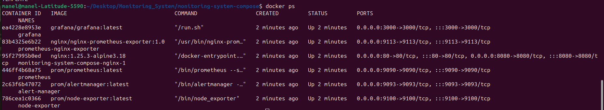
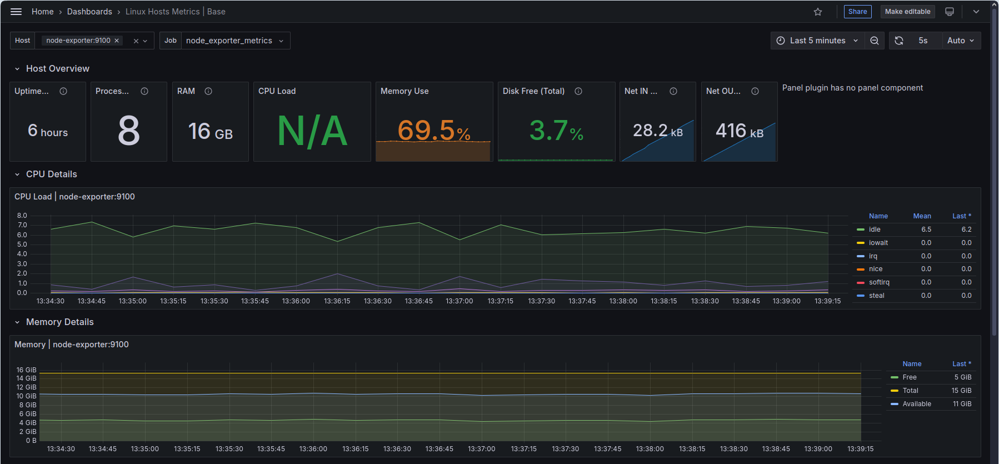
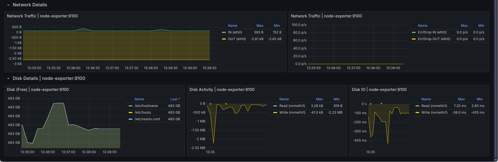
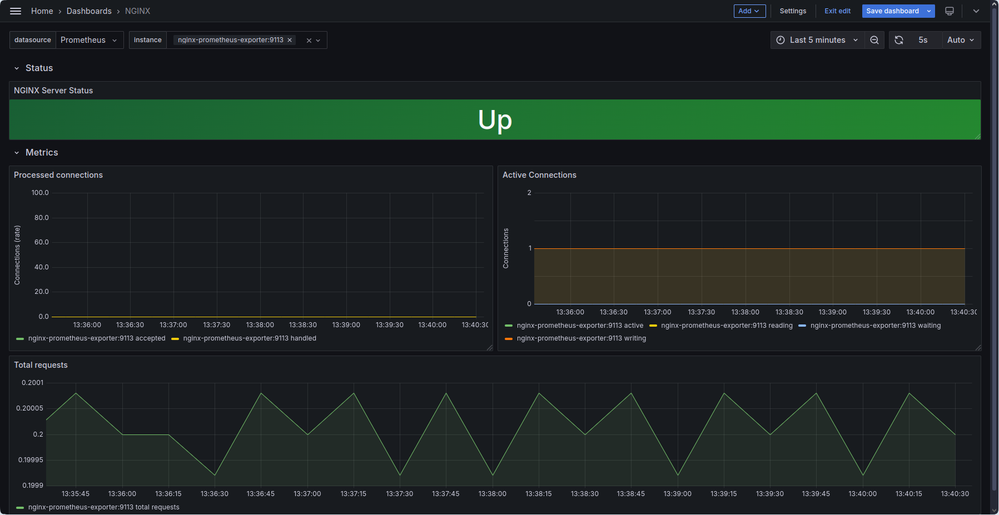
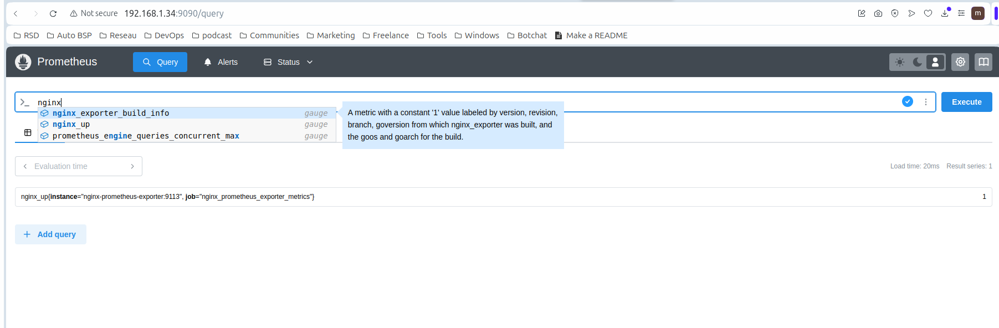
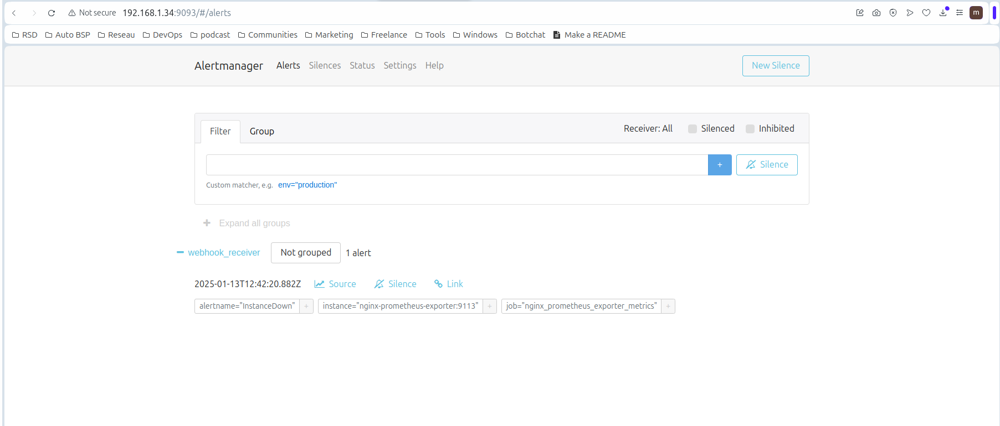

# Monitoring System
This project demonstrates a DevOps monitoring system that leverages Vagrant, Ansible, and Docker Compose to automate the deployment of a monitoring stack which includes Prometheus, Grafana, and Alertmanager. The system is designed to monitor a sample NGINX application and provide real-time insights into its performance.


## Prerequisites
Before setting up the monitoring system, ensure the following tools are installed on your local machine:

- Vagrant: Provisions virtual machines (VMs) on local hypervisors. Alternatively, Terraform can be used to provision VMs on remote platforms like Proxmox or cloud providers.
- Ansible: Configures the target VM(s).
- VirtualBox: Hypervisor for running the VMs.
> Ensure the VirtualBox path is added to your system's environment variables.
- Git: clones the repository.

## Step 0: Clone the repository
- Clone the Repository:
```bash
$ git clone https://github.com/MaNel-ken/Monitoring_System.git
$ cd Monitoring_System
```
## Step 1: Provision VMs using Terraform
- Vagrantfile Setup:\
Navigate to the Vagrant file and adjust the public address assigned to the VM.
```bash
$ cd vagrant
```

- Provision the VM:\
Run the following commands to create, configure, and start the VM:
```bash
$ vagrant up
```

## Step 2: Configure VM using Ansible Playbooks

- Inventory File: \
Update the inventory file with the IP address of the monitoring system VM (the Ansible agent):
```ini
[DockerCompose]
node ansible_host= <ip_address_MS_VM>
```

- Set Up Ansible on the Local Host:\
Configure the local machine as an Ansible controller. Run the setup script to install Ansible, generate SSH keys, exchange the public key with the target VM, and verify the connection:
```bash
$ cd ansible
$ ./setup_ansible.sh
```
- Ansible playbook:\
Run the Ansible playbook to install the necessary packages ansible agent and deploy the Monitoring Services.
> Use the -i option to specify the inventory file 
>aUse the -u option to define the remote user. In this case, the user is vagrant, as the VM is provisioned using a Vagrant box:
```bash
$ ansible-playbook  package_installation_runnning_compose.yml -i inventory -u vagrant
```
> Outcome: Once the playbook completes successfully:\

All services—Prometheus, Grafana, Alertmanager, and the sample NGINX server—will be running.

## Step 3: Deploy Monitoring Services with Docker Compose
- SSH into the monitoring VM:
```bash
$ ssh vagrant@monitoring_vm_ip 
```
- Check Running Services: \
Verify that all services are up and running with the following command:
```bash
$ docker compose ps
```


## Verification and Testing
1. Access Grafana: 
- Navigate to http://<monitoring_vm_ip>:3000 to access Grafana and log in with the default credentials (`admin`:`admin`). 


- Once logged in, you will see two pre-configured dashboards that were mounted in the dashboard directory when the container was created:

A dashboard for monitoring overall system metrics collected by `Prometheus`.


A dashboard for monitoring NGINX metrics collected by the `NGINX exporter`.  


Grafana offers a wide range of `pre-built dashboards` that can be imported based on what you want to monitor. You can browse and download these dashboards from the official [Grafana Dashboard Library](https://grafana.com/grafana/dashboards).  

2. View Prometheus Metrics: 
- Visit http://<monitoring_vm_ip>:9090 to access Prometheus and explore the metrics collected:


- Review the targets and alerts that have been configured.


3. View Nginx webpage:
Visit http://<monitoring_vm_ip>:80 to access Nginx webpage.


4. Test Alerts: 
- To test the alerting system, we trigger an alert by stopping the NGINX instance. This will cause Prometheus to fire an alert after 1 minute and notify Alertmanager.

```bash
$ docker compose pause nginx
```
- Grafana Dashboard Update: after few second we can see that service is down in dashboard status.


- Pending status of the alert:


- After 1min, prometheus Fires the alert:


- Alertmanager Receiving the Alert:


- Webhook Notification:


## Troubleshooting
### Issue: Can't ssh to the VM
**Symptoms:**
- Unable to establish an SSH connection to the VM.
- Receiving an "Authentication failed" error.

**Cause:**
- Some server providers, such as Amazon EC2 and Google Compute Engine, Vagrant disable SSH password authentication by default. 
That is, you can only log in over SSH using public key authentication, which mean You have to add the public key manually to the remote server.

**Solution:** Allow ssh to VMs
1. Log in as root user:
```bash
$ sudo -i 
```
2. Edit the SSH configuration file:
```bash
$ nano /etc/ssh/sshd_config
```
3. Change the following lines: 
-  `PasswordAuthentication no`    to      `PasswordAuthentication yes`
- `#PubkeyAuthentication yes` to `PubkeyAuthentication yes`

4. Save the changes and Restart the SSH service:
```bash
$ sudo service ssh restart
```
---

### Issue: Can't apply Ansible playbook
**Symptoms:**
- Error message when running an Ansible playbook:  {"changed": false, "module_stderr": "Shared connection to localhost closed.\r\n", "module_stdout": "/bin/sh: 1: /usr/bin/python: not found\r\n", "msg": "MODULE FAILURE\nSee stdout/stderr for the exact error", "rc": 127}

**Cause:**
- Python is not installed on the remote VM. Ansible relies on Python to execute tasks on the remote machine.

**Solution:** Install Python on the remote VM
1. Install python :
```bash
$ sudo apt install python -y
```
2. Re-run the Ansible playbook.
---
### Issue: Docker Compose services fail to start.
**Symptoms:**
- Docker Compose services are not running or crash immediately after starting.

**Cause:**
- The root cause can vary, such as misconfigured Docker Compose files, missing environment variables, or issues within the Docker images themselves.

**Solution:** Check Docker logs using docker-compose logs to diagnose the issue.
1. Use Docker Compose to view logs and diagnose the issue:
```bash
$ docker-compose logs
```
2. Identify any error messages or issues within the logs and take appropriate action, such as correcting configuration files or resolving dependency issues.

## Customization

### Add New Services
To add additional services or exporters, modify the `docker-compose.yml` file. 

### Update Alert Rules
Customize Prometheus alert rules by editing the `alertrules.yml` configuration file located in the `prometheus` directory.

### Add alert Receivers 
Customize additional alert receivers in Alertmanager by editing the `alertmanager.yml` file located in the `alertmanager` directory.

### Add Grafana Dashboards
To permanently add a new Grafana dashboard, place the corresponding JSON file in the `monitoring-system-compose/grafana/dashboards/` directory. Alternatively, you can import a dashboard temporarily (until the service reboots) through the Grafana UI.

